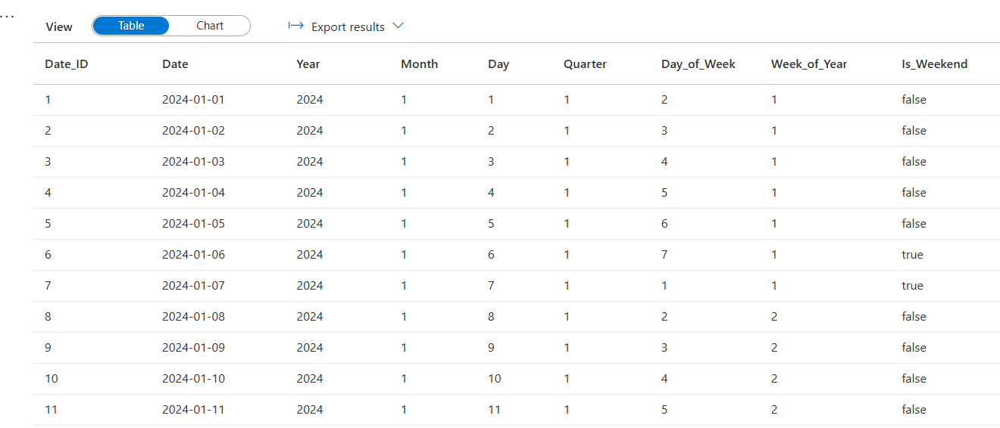
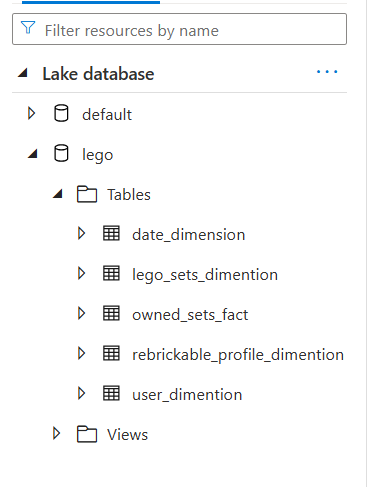
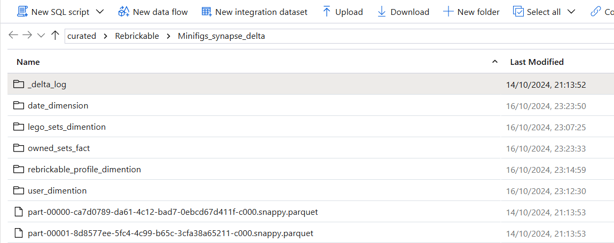

# Explanation of Data Load Process in Dimension and Fact Tables
## Introduction
This document explains the process of loading data into dimension and fact tables in a data warehouse using Spark with PySpark and Azure Synapse. The notebook utilizes various Spark transformations and SQL commands to merge, read, and process data from JSON files into relevant tables. The approach ensures that the data is effectively handled for analytics purposes.

### 1. Environment Setup
The notebook begins by setting up the Spark environment. This involves defining the Spark pool that provides the required computational resources.

```python 
spark_pool = 'MySparkPool'
``` 
Explanation:
- This line specifies the name of the Spark pool as MySparkPool. The resources for running the Spark jobs will be drawn from this pool.
### 2. Loading and Processing JSON Files
The notebook retrieves JSON files from an Azure Data Lake storage location. These files are then processed and prepared for insertion into dimension and fact tables.

#### 2.1 Listing Files in the Azure Data Lake Folder
First, the code lists all the files in a specified folder of the Azure Data Lake using mssparkutils.fs.ls.

```python 
files = mssparkutils.fs.ls("abfss://raw@adlg2dev.dfs.core.windows.net/SomeFolder")
```
Explanation:
- mssparkutils.fs.ls: Lists all the files in the specified Azure Data Lake folder.
- The path "abfss://raw@adlg2dev.dfs.core.windows.net/SomeFolder" specifies the storage location.
- Dummy Information: Folder path: abfss://raw@some_account_name.dfs.core.windows.net/DummyFolder

#### 2.2 Reading and Exploding JSON Files
Next, the notebook reads each file and processes its contents. This involves exploding any nested arrays and adding additional metadata, such as the user and date_added.

```python 
for file in files:
    temp_df = (spark.read
               .option("multiline", "true")
               .format('json')
               .load(file.path)
               .withColumn("explodedArray", explode(col('results')))
               .withColumn("user", lit(file.name.split('.')[0]))
               .withColumn("date_added", current_timestamp()))
```
Explanation:
- spark.read: Reads the files in JSON format.
- option("multiline", "true"): Ensures that multi-line JSON files are read correctly. 
- explode(col('results')): Breaks down the nested results array in each file into individual rows.  
- withColumn("user", lit(file.name.split('.')[0])): Adds a new column user using the filename (before the extension).
- withColumn("date_added", current_timestamp()): Adds a column for the current timestamp when the data is added. 
- This step transforms the data into a format suitable for insertion into the target tables.


#### 2.3 Creating a Temporary View for SQL Queries
After processing the data into a DataFrame, the notebook creates a temporary view of the data. This allows the data to be accessed using SQL.

```python 
temp_df.createOrReplaceTempView("source_data")
``` 
Explanation:
- createOrReplaceTempView("source_data"): Registers the DataFrame temp_df as a temporary SQL view called source_data. This makes the data available for querying using SQL commands.
### 3. Data Insertion into Dimension and Fact Tables
Once the data is ready, it is inserted into dimension and fact tables. This involves using the MERGE INTO statement to update existing records or insert new ones.

#### 3.1 Dimension Tables
The dimension tables store reference data to support the fact table. The code performs upserts (merge operations) into various dimension tables, ensuring they are populated to cater to **SC 1**.

##### 3.1.1 Inserting into Lego_Sets_Dimension
The Lego_Sets_Dimension table stores information about Lego sets. The following SQL query merges data into this dimension table:

```python 
spark.sql("""
    MERGE INTO Lego.Lego_Sets_Dimension AS target
    USING updated_keys AS source
    ON target.SetNumber = source.SetNumber
    WHEN MATCHED THEN
        UPDATE SET target.Set_Dim_Key = source.Set_Dim_Key
    WHEN NOT MATCHED THEN
        INSERT (SetNumber, Set_Dim_Key)
        VALUES (source.SetNumber, source.Set_Dim_Key)
""")
```
Explanation:
- MERGE INTO: Performs an upsert operation (i.e., update or insert).
- WHEN MATCHED THEN UPDATE: Updates existing records where SetNumber matches.
- WHEN NOT MATCHED THEN INSERT: Inserts new records if no match is found on SetNumber.


The following images show the populated data in the Lego_Sets_Dimension. The second image clearly displays the name of each theme, which is fetched from the themes dataset. <br>


<br>
<br>


<br>

##### 3.1.2 Inserting into Rebrickable_Profile_Dimension
The Rebrickable_Profile_Dimension table stores information about user profiles and their associated LEGO sets.

```python 
spark.sql("""
        MERGE INTO lego.Rebrickable_Profile_Dimension AS rp
        USING (
            SELECT DISTINCT c.user AS User_ID, c.list_id, c.name AS Set_Name, ...
        )
        ON rp.Set_Num = c.set_num
           AND rp.List_ID = c.list_id
        WHEN MATCHED AND (
            rp.User_ID <> c.User_ID OR ...
        ) THEN
            UPDATE ...
""")
```
This query performs an upsert to update or insert user profile records. When matched, it updates the User_ID, Set_Name, and Set_Num fields if there are differences. If no match is found, a new record is inserted.

Table: Rebrickable_Profile_Dimension
Columns: User_ID, List_ID, Set_Name, Set_Num, Date_Added

<br>


<br>

##### 3.1.3 Inserting into Lego_Date_Dimension
The Lego_Date_Dimension table stores date-related information, typically used to track transactions in the fact table.
```python 
spark.sql("""
    MERGE INTO Lego.Lego_Date_Dimension AS target
    USING date_keys AS source
    ON target.Date_ID = source.Date_ID
    WHEN MATCHED THEN
        UPDATE SET target.Date_Dim_Key = source.Date_Dim_Key
    WHEN NOT MATCHED THEN
        INSERT (Date_ID, Date_Dim_Key)
        VALUES (source.Date_ID, source.Date_Dim_Key)
""")
```
Explanation:
- Similar to the other dimension tables, this query performs an upsert to update or insert date records.
- The following images show the populated data in the Lego_Date_Dimension.

<br>



<br>

#### 3.2 Inserting into the Fact Table: Owned_Sets_Fact
The fact table stores transactional data about Lego sets, linking users, sets, and dates. The code inserts new records into this table:

```
spark.sql("""
    INSERT INTO Lego.Owned_Sets_Fact (Owned_Fact_ID,Set_ID, User_ID, Date_ID, Price)
    SELECT Owned_Fact_ID,Set_ID, User_ID, Date_ID, Price
    FROM source_data
""")
```
Explanation:
- INSERT INTO: Inserts new records into the fact table.
- The SELECT statement retrieves the necessary fields (SetNumber, User_ID, Date_ID, Price) from the source_data temp view.

<br>


<br>

### 4. Use of createOrReplaceTempView
The function createOrReplaceTempView allows a DataFrame to be registered as a temporary SQL view, making it accessible via SQL queries. In the code, this is used to enable SQL-based operations on the DataFrame data.

```python 
temp_df.createOrReplaceTempView("source_data")
```
Explanation:
createOrReplaceTempView creates a temporary view called source_data from the DataFrame temp_df. This enables the data to be queried directly using SQL, such as in the fact table insertion described above.
### 5. Data Validation Using SQL Queries
After data insertion, validation queries are run to verify the data was successfully loaded into the **Fact** table.

```python

spark.sql("SELECT * FROM Lego.Owned_Sets_Fact").show()
```
Explanation:
- This query retrieves and displays the contents of the Owned_Sets_Fact table, showing the inserted records. Following images shows the data contained in it. 
<br>


<br>

### 6. Register the Tables in a Catalog:
Azure Synapse Analytics was used to register the tables in a catalog. This allows SQL queries to be executed using table names without needing to reference the file paths directly, simplifying data access and query execution. The following image shows how all the tables look after being registered in the catalog.


<br>



<br>

### 7. Final Structure of tables in Data Lake
The final structure of the dimensional and fact tables is shown in the image below. This structure has been kept simple, as it utilizes Delta format underneath, which facilitates efficient data management and query performance.

<br>



<br>

### 7. Conclusion
This notebook automates the process of loading, merging, and inserting data into dimension and fact tables using PySpark and SQL in an Azure Synapse environment. The dimension tables are populated to cater to SC 1, ensuring that reference data is available to support the fact table. This process guarantees data consistency and efficient loading from the raw files stored in an Azure Data Lake to the appropriate data warehouse tables.
